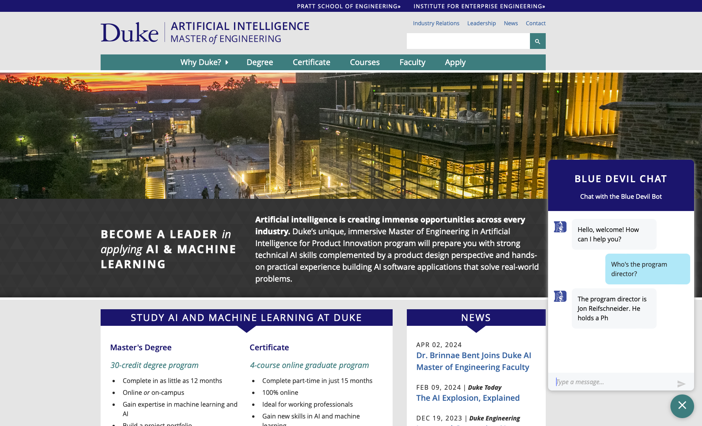
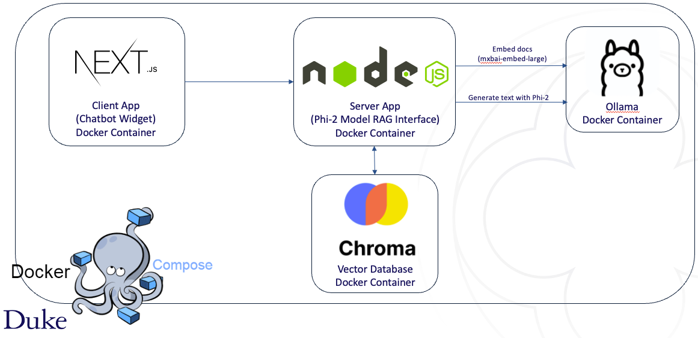

# AIPI-590 Project 2: AIPI Chatbot

This is the repository for Project 2 of the AIPI-590 (LLMs) course of the MEng in Artificial Intelligence at Duke University.

## Description

This project consists of building a chatbot that is able to answer questions about the AIPI program at Duke.

## Live Demo

Link: [Live Demo](http://34.0.241.227:5666/)

## System Architecture

## Getting Started

### Dependencies

This project leverages Docker containerization for easier execution and deployment. Using Docker Compose it's possible to automatically install all the dependencies for both applications (server and client) and run them.

### Running the application

1. Clone the repository
2. Install Docker and Docker compose if not already installed
3. Run setup.sh script to:
   1. Build the Docker images and start the containers
   2. Pull the Phi-2 model and embedding models to Ollama
   3. Generate embeddings and insert data into the ChromeDB vector database
4. Voilà! You have a working system up and running!

## Author
[João Cardoso](https://www.linkedin.com/in/joaopsc/)
